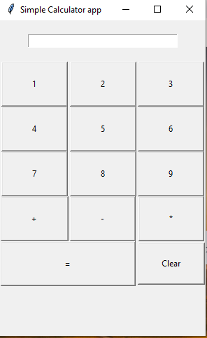

# 🧮 Simple Calculator App

A beginner-friendly calculator app built using **Python** and the **Tkinter** GUI toolkit. This simple app allows users to perform basic arithmetic operations within a clean graphical interface.

---

## 📦 Features

- 🔢 Number buttons (0–9)
- ➕ Addition
- ➖ Subtraction
- ✖️ Multiplication
- 🧮 Equals (`=`) button to evaluate
- 🔄 Clear button to reset input

---

## 🛠️ Technologies Used

- Python 3
- Tkinter (built-in Python GUI library)

---

## 🚀 How to Run

1. Make sure you have **Python 3** installed.
2. Save the code to a file named `calculator.py`.
3. Open a terminal and run the following command:

   ```bash
   python calculator.py


## 📸 Screenshot 


